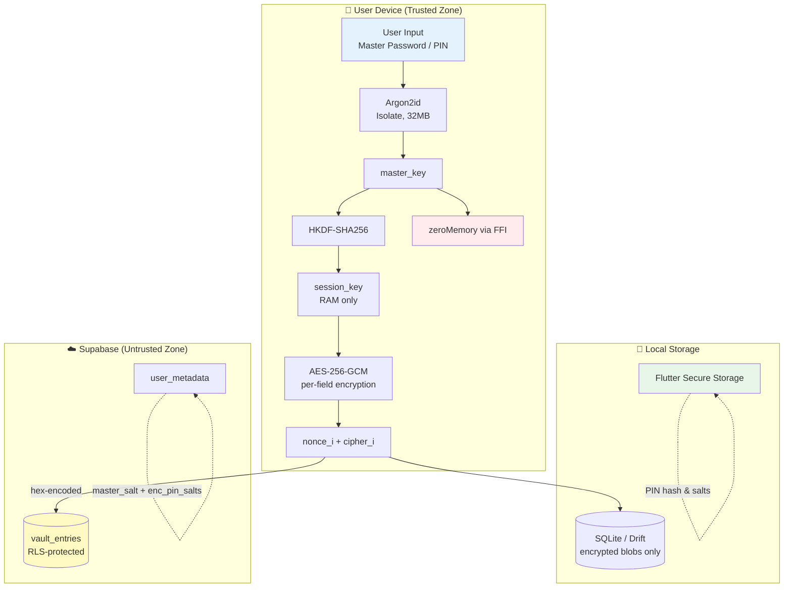

# VaultX 🔐

> **Zero-Knowledge Password Manager for Android & Windows**
> *Your passwords. Your keys. Your device. Nobody else — not even us — can read them.*

[]()
[]()
[](https://opensource.org/licenses/Apache-2.0)
[]()
[]()
[]()

---

## 📖 Table of Contents

1. [Overview](#-overview)
2. [Core Features](#-core-features)
3. [Security Architecture](#-security-architecture)
4. [Cryptographic Flow](#-cryptographic-flow)
5. [Data Model](#-data-model)
6. [Project Structure](#-project-structure)
7. [Tech Stack](#-tech-stack)
8. [Getting Started](#-getting-started)
9. [Supabase & Auth Redirect Setup](#-supabase--auth-redirect-setup)
10. [Building for Release](#-building-for-release)
11. [Testing](#-testing)
12. [Security Hard Rules](#-security-hard-rules)
13. [License](#-license)

---

## 🌟 Overview

**VaultX** is a fully offline-first, zero-knowledge password manager built with Flutter. Unlike traditional password managers, VaultX encrypts **every single sensitive field independently** on your device *before* any data ever touches SQLite or Supabase. The server never sees plaintext — not your passwords, not your usernames, not even your site names.

Designed for users who demand absolute control over their cryptographic keys, VaultX features seamless cross-platform sync, portable disaster recovery backups, and hardware-backed key storage.

> ⚠️ **SECURITY WARNING — BY DESIGN:** 
> **Loss of Master Password = permanent, irrecoverable data loss.** There is no reset link, no recovery key, and no support team that can decrypt your data. This is a feature, not a bug.

---

## ⚡ Core Features

### 🔒 Security-First & Zero-Knowledge
- **Per-field AES-256-GCM encryption** — every sensitive field has its own unique 12-byte `FortunaRandom` nonce.
- **Argon2id KDF** (memory-hard) running in Dart Isolates to prevent UI blocking. Standardized at 32MB memory cost across all platforms for deterministic cross-platform sync.
- **HKDF-SHA256** session key derivation.
- **Hardware-backed key storage** (Android StrongBox HSM / Windows TPM 2.0 via Credential Manager).
- **Constant-time comparison** for PIN and key verification to prevent timing attacks.
- **FFI-based memory zeroing** of keys immediately after cryptographic operations.

### 🔄 Cross-Platform Sync & "Both" PIN Architecture
- **Offline-first** architecture with local SQLite (Drift ORM).
- **Last-write-wins conflict resolution** via Supabase Postgres with soft-delete tombstones.
- **Cross-Platform PIN Sync:** Vault PIN salts are stored locally in the hardware keystore *and* encrypted with the session key and backed up to Supabase metadata. If you log into a new device or the OS wipes your keystore, the app silently restores your PIN salts using your Master Password.
- **Row Level Security (RLS)** strictly enforced on all Supabase tables.

### 🧳 Data Portability & Disaster Recovery
- **Portable Encrypted Backup (`.vltx`):** Exports your entire vault into a standalone, encrypted JSON file. Completely independent of Supabase; survives server outages and can be imported on any device.
- **Plaintext CSV Export/Import:** Standardized format for migrating to/from other password managers (Bitwarden, 1Password, KeePass).
- **Native Android 13+ SAF Integration:** Uses the native Storage Access Framework "Save As" dialog to bypass Scoped Storage restrictions without requiring invasive file permissions.
- **Deep Clean & Account Deletion:** Granular controls to wipe local device cache or permanently nuke server-side data.

### 🧠 Password Intelligence & UX
- **In-Memory Full-Text Search:** Instantly filter your vault by site name using a decrypted RAM cache (zero UI thread blocking).
- **3-tier password generator** (Strong / Very Strong / Maximum) with Fisher-Yates shuffling via `FortunaRandom`.
- **`zxcvbn` strength scoring** with visual feedback.
- **HaveIBeenPwned k-anonymous breach check** — only the first 5 SHA-1 prefix characters leave the device.

### 🛡️ Threat Mitigation
- **Screenshot & screen recording blocking** (Android `FLAG_SECURE`, best-effort on Windows).
- **Root / jailbreak detection** (soft warning on Android).
- **10-attempt PIN wipe** — vault is cryptographically destroyed after repeated failures.
- **30-second auto-clipboard clear** after copying passwords.

---

## 🏗️ Security Architecture



### The Zero-Knowledge Guarantee

| Data | Where it lives | Encrypted? |
|------|----------------|-----------|
| Passwords, usernames, site names, URLs, notes | Device RAM → SQLite → Supabase | ✅ AES-256-GCM (per-field) |
| Master key | RAM only (zeroed after HKDF) | N/A |
| Session key | RAM only (zeroed on lock) | N/A |
| Argon2id master salt | Supabase `user_metadata` | ❌ (not secret — just a salt) |
| Vault PIN salts | Local HSM + Supabase (encrypted by session key) | ✅ Hardware-backed + AES-GCM |
| `is_favourite`, `is_breached`, timestamps | SQLite + Supabase | ❌ (non-sensitive metadata) |

---

## 🔐 Cryptographic Flow

### 1. Master Password & Session Key
```text
master_password (15-128 chars)
    ↓
Argon2id(password, salt=16 bytes, t=3, p=4, m=32MB, out=32B)  [in Isolate]
    ↓
master_key
    ↓
HKDF-SHA256(master_key, user_id, "vaultx-session-v1")
    ↓
session_key (32 bytes, lives in RAM)
    ↓
zeroMemory(master_key)  [via FFI]
```

### 2. Portable Backup Crypto (`.vltx`)
To ensure backups survive Supabase outages, the export process decrypts data from the local DB and re-encrypts it with a user-provided Export Password.
```text
1. User provides Export Password + Vault PIN
2. Decrypt password fields from DB using vault_key
3. Decrypt metadata fields from DB using session_key
4. Derive export_key = Argon2id(export_password, export_salt)
5. Re-encrypt ALL fields using export_key
6. Save to .vltx JSON file
```

---

## 📊 Data Model

### `EncryptedEntry` Schema (SQLite & Supabase)

| Column | Type | Encrypted |
|--------|------|-----------|
| `id` | UUID (PK) | ❌ |
| `site_name_nonce` / `site_name_cipher` | BLOB | ✅ (session_key) |
| `site_url_nonce` / `site_url_cipher` | BLOB | ✅ (session_key) |
| `username_nonce` / `username_cipher` | BLOB | ✅ (session_key) |
| `password_nonce` / `password_cipher` | BLOB | ✅ (**vault_key**) |
| `notes_nonce` / `notes_cipher` | BLOB | ✅ (session_key) |
| `category_nonce` / `category_cipher` | BLOB | ✅ (session_key) |
| `is_favourite`, `is_breached`, `deleted` | BOOLEAN | ❌ |
| `created_at`, `modified_at` | DATETIME | ❌ |
| `device_id`, `sync_pending` | TEXT/BOOL | ❌ |

---

## 📁 Project Structure

```text
vault_x/
├── lib/
│   ├── main.dart                  # App entry, Supabase init, SQLite check
│   ├── app.dart                   # GoRouter, Material 3 theme
│   │
│   ├── crypto.dart                # Argon2id, AES-GCM, HKDF, FortunaRandom, FFI zeroing
│   ├── models.dart                # VaultEntry (RAM) + EncryptedEntry (DB)
│   ├── storage.dart               # Drift schema, SecureStorageService
│   ├── auth.dart                  # Supabase Auth, Cross-platform PIN sync
│   ├── sync.dart                  # Supabase CRUD, offline queue, last-write-wins
│   ├── export_import.dart         # .vltx and CSV portable backup logic
│   ├── generator.dart             # Password gen, zxcvbn, HIBP k-anon check
│   ├── utils.dart                 # Clipboard, exceptions, hex helpers
│   ├── platform.dart              # Screenshot block, root detect, lifecycle
│   │
│   └── screens/
│       ├── login.dart / register.dart / verify_email.dart / forgot_password.dart
│       ├── setup_master.dart / setup_pin.dart / unlock.dart
│       ├── vault_list.dart        # Main vault + In-memory search
│       ├── add_edit_entry.dart    # Add/edit with inline generator
│       ├── pin_gate.dart          # PIN modal + 10-attempt wipe
│       ├── reveal.dart            # 30s password reveal
│       ├── settings.dart          # Preferences, Deep Clean, Delete Account
│       ├── export_dialog.dart     # Native SAF export UI
│       └── import_screen.dart     # Portable backup import UI
│
├── test/
│   ├── crypto_test.dart           # 10 mandatory crypto tests
│   └── integration_test.dart      # Full E2E flow
│
├── config/
│   └── supabase.sql               # Schema + RLS policies
├── installer.iss                  # Inno Setup script for Windows .exe installer
└── pubspec.yaml
```

---

## 🚀 Getting Started

### Prerequisites
- Flutter SDK ≥ 3.11.1
- Android Studio (for Android build)
- Visual Studio 2022 with C++ Desktop workload (for Windows build)
- A [Supabase](https://supabase.com) account

### Installation

```bash
# 1. Clone the repository
git clone https://github.com/YOUR-USERNAME/vault_x.git
cd vault_x

# 2. Install dependencies
flutter pub get

# 3. Generate Drift code
dart run build_runner build --delete-conflicting-outputs

# 4. Create your .env file
cat > .env << EOF
SUPABASE_URL=https://your-project.supabase.co
SUPABASE_ANON_KEY=your-anon-key-here
EOF

# 5. Run on your device
flutter run
```

---

## 🗄️ Supabase & Auth Redirect Setup

VaultX uses a **web-based redirect** (hosted on GitHub Pages) to handle email verification and password resets seamlessly across Android and Windows without complex deep linking.

### 1. Deploy the Database Schema
Run `config/supabase.sql` in the Supabase SQL Editor. This creates the `vault_entries` table and enables strict Row Level Security (RLS).

### 2. Configure Email Auth
Go to **Authentication → Providers → Email** and enable "Confirm email".

### 3. Setup the GitHub Pages Redirect App
1. Create a new public GitHub repository named `vaultx-auth`.
2. Create an `index.html` file that handles Supabase URL hash fragments (`#type=signup`, `#type=recovery`) and displays the appropriate UI:
   - **For Signups:** Displays "Link Verified ✅ Your secure link was accepted."
   - **For Recovery:** Displays a "Set New Password" form.
3. Enable **GitHub Pages** in the repository settings (Deploy from `main` branch).
4. Your live URL will look like: `https://your-username.github.io/vaultx-auth/`

### 4. Link Supabase to the Redirect App
Go to **Authentication → URL Configuration** in Supabase:
- **Site URL:** `https://your-username.github.io/vaultx-auth/`
- **Redirect URLs:** Add `https://your-username.github.io/vaultx-auth/**`

---

## 📦 Building for Release

> ⚠️ **Never distribute debug binaries.** Release builds enforce obfuscation and R8 minification to protect the Dart bytecode.

### Android APK / AAB
```bash
flutter build apk --release --obfuscate --split-debug-info=./debug-info
```

### Windows Executable & Installer
1. Build the obfuscated Windows binary:
   ```bash
   flutter build windows --release --obfuscate --split-debug-info=./debug-info
   ```
2. **Create the Installer:** Download [Inno Setup](https://jrsoftware.org/isdl.php), open the `installer.iss` file in the root directory, and press `Ctrl+F9` to compile. This generates a professional `VaultX_Setup.exe` in the `installer_output` folder.

---

## 🧪 Testing

### Mandatory Crypto Tests
```bash
flutter test test/crypto_test.dart
```
*All 10 tests must pass before any release. Tests include nonce uniqueness, GCM tampering detection, Isolate non-blocking, and FFI memory zeroing.*

### Integration Test
```bash
flutter test integration_test
```
*Full flow: register → set PIN → save entry → sync → lock → relaunch → restore.*

---

## 🚫 Security Hard Rules

These rules are enforced throughout the codebase. Violating any produces a security vulnerability.

### Cryptography
- ❌ **NEVER** use `dart:math.Random` — `FortunaRandom` only.
- ❌ **NEVER** reuse a nonce — `encrypt()` generates its own.
- ❌ **NEVER** use `==` for PIN/key comparison — `constantTimeEquals()` always.
- ❌ **NEVER** store plaintext for sensitive fields.
- ❌ **NEVER** log secrets, keys, nonces, or PINs.
- ✅ **ALWAYS** `zeroMemory()` every key after use.
- ✅ **ALWAYS** run Argon2id in a Dart Isolate.
- ✅ **ALWAYS** enforce 15 ≤ password ≤ 128 before hashing.
- ✅ **ALWAYS** use identical Argon2id memory parameters (32MB) across all platforms to ensure cross-platform sync compatibility.

### Platform & Storage
- ❌ **NEVER** call `root_detect` or `flutter_windowmanager` on Windows.
- ❌ **NEVER** store master/session key in SharedPreferences, Hive, or SQLite.
- ❌ **NEVER** add a PIN reset or recovery path (PIN is immutable by design).
- ✅ **ALWAYS** enable RLS on all Supabase tables.
- ✅ **ALWAYS** verify SQLite ≥ 3.50.2 at startup.

---

## ⚠️ Known Limitations

These are **intentional design tradeoffs** documented for transparency:

1. **No password recovery.** Loss of Master Password = permanent data loss.
2. **No SQLCipher.** Per-field AES-256-GCM provides application-layer confidentiality. Schema and SQLite temp files are not encrypted — accepted risk on single-user devices.
3. **Windows screenshot protection is partial.** Win32 FFI cannot block all GPU-level capture tools.
4. **Last-write-wins sync.** No conflict resolution UI. Acceptable for single-user.
5. **No TOTP 2FA.** Replaced by Supabase email OTP for simplicity.
6. **No browser extension or autofill.** Out of scope for v1.0.

---

## 📄 License

This project is licensed under the **Apache License 2.0**.

```text
Copyright [yyyy] [name of copyright owner]

Licensed under the Apache License, Version 2.0 (the "License");
you may not use this file except in compliance with the License.
You may obtain a copy of the License at

    http://www.apache.org/licenses/LICENSE-2.0

Unless required by applicable law or agreed to in writing, software
distributed under the License is distributed on an "AS IS" BASIS,
WITHOUT WARRANTIES OR CONDITIONS OF ANY KIND, either express or implied.
See the License for the specific language governing permissions and
limitations under the License.
```

---

<div align="center">

**Built with 🔒 and paranoia.**

*If you can read your passwords in the database, you're doing it wrong.*

</div>
```
