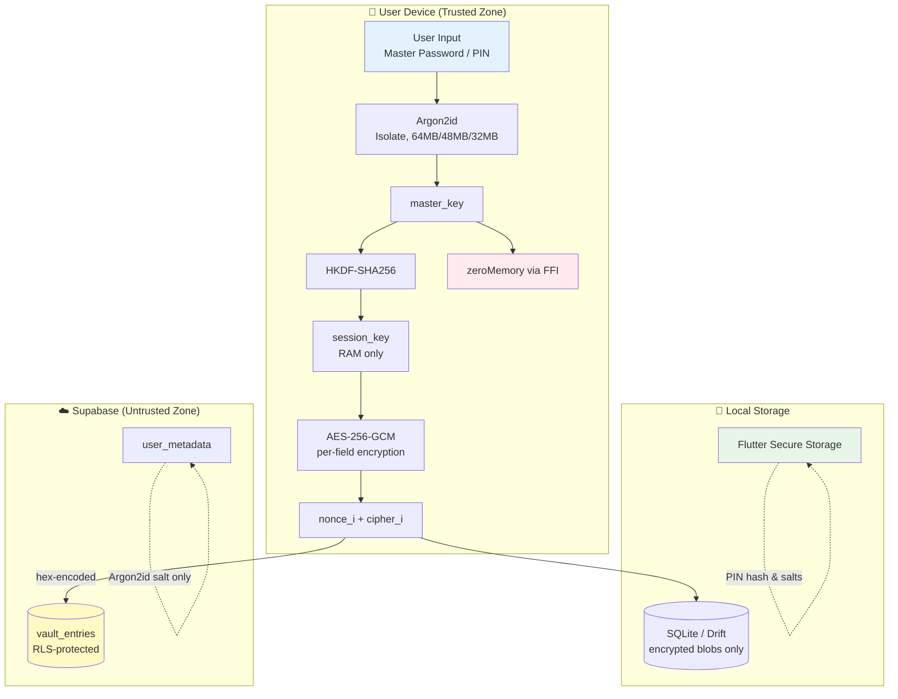

# VaultX 🔐

> **Zero-Knowledge Password Manager for Android & Windows**
> *Your passwords. Your keys. Your device. Nobody else — not even us — can read them.*

[]()
[]()
[](https://opensource.org/licenses/Apache-2.0)
[]()
[]()
[]()

---

## 📖 Table of Contents

1. [Overview](#-overview)
2. [Core Features](#-core-features)
3. [Security Architecture](#-security-architecture)
4. [Cryptographic Flow](#-cryptographic-flow)
5. [Data Model](#-data-model)
6. [Platform Feature Matrix](#-platform-feature-matrix)
7. [Project Structure](#-project-structure)
8. [Tech Stack](#-tech-stack)
9. [Getting Started](#-getting-started)
10. [Supabase Setup](#-supabase-setup)
11. [Auth Redirect Setup (GitHub Pages)](#-auth-redirect-setup)
12. [Building for Release](#-building-for-release)
13. [Testing](#-testing)
14. [Security Hard Rules](#-security-hard-rules)
15. [Known Limitations](#-known-limitations)
16. [License](#-license)

---

## 🌟 Overview

**VaultX** is a fully offline-first, zero-knowledge password manager built with Flutter. Unlike traditional password managers, VaultX encrypts **every single sensitive field independently** on your device *before* any data ever touches SQLite or Supabase. The server never sees plaintext — not your passwords, not your usernames, not even your site names.

**Loss of Master Password = permanent data loss.** This is by design. There is no recovery path, no admin override, and no cloud backup of keys.

---

## ⚡ Core Features

### 🔒 Security-First
- **Per-field AES-256-GCM encryption** — every sensitive field has its own unique 12-byte nonce
- **Argon2id KDF** (memory-hard) running in Dart Isolates to prevent UI blocking
- **HKDF-SHA256** session key derivation
- **Hardware-backed key storage** (Android StrongBox HSM / Windows TPM 2.0 via Credential Manager)
- **Constant-time comparison** for PIN and key verification
- **FFI-based memory zeroing** of keys after every cryptographic operation

### 🛡️ Threat Mitigation
- **Screenshot & screen recording blocking** (Android `FLAG_SECURE`, best-effort on Windows)
- **Root / jailbreak detection** (soft warning on Android)
- **10-attempt PIN wipe** — vault is cryptographically destroyed after repeated failures
- **30-second auto-clipboard clear** after copying passwords
- **Auto-lock on app backgrounding** (lifecycle-aware)

### 🔄 Sync & Reliability
- **Offline-first** architecture with local SQLite (Drift ORM)
- **Last-write-wins conflict resolution** via Supabase Postgres
- **Soft-delete tombstones** for cross-device sync consistency
- **Row Level Security (RLS)** on all Supabase tables

### 🧠 Password Intelligence
- **3-tier password generator** (Strong / Very Strong / Maximum) with `FortunaRandom`
- **`zxcvbn` strength scoring** with visual feedback
- **HaveIBeenPwned k-anonymous breach check** — only 5 SHA-1 prefix chars leave the device
- **Breach badge** on compromised entries in the vault list

### 🔑 Authentication
- **Supabase Auth** with email verification
- **Optional Email OTP 2FA**
- **Biometric unlock** (Fingerprint on Android, Windows Hello on Windows)
- **Email-based password reset** via GitHub Pages redirect

---

## 🏗️ Security Architecture



### The Zero-Knowledge Guarantee

| Data | Where it lives | Encrypted? |
|------|----------------|-----------|
| Passwords, usernames, site names, URLs, notes, categories | Device RAM → SQLite → Supabase | ✅ AES-256-GCM (per-field) |
| Master key | RAM only (zeroed after HKDF) | N/A |
| Session key | RAM only (zeroed on lock) | N/A |
| Argon2id salt | Supabase `user_metadata` | ❌ (not secret — just a salt) |
| PIN hash + salts | Android StrongBox / Windows TPM | ✅ Hardware-backed |
| `is_favourite`, `is_breached`, timestamps | SQLite + Supabase | ❌ (non-sensitive metadata) |

---

## 🔐 Cryptographic Flow

### 1. Master Password Setup
```
master_password (15-128 chars)
    ↓
Argon2id(password, salt=16 bytes, t=3, p=4, m=64MB, out=32B)  [in Isolate]
    ↓
master_key
    ↓
HKDF-SHA256(master_key, user_id, "vaultx-session-v1")
    ↓
session_key (32 bytes, lives in RAM)
    ↓
zeroMemory(master_key)  [via FFI]
```

### 2. Vault PIN Setup
```
pin (6+ digits)
    ↓
Argon2id(pin, pin_salt) → pin_hash          (stored in StrongBox/TPM)
Argon2id(pin, vault_key_salt) → vault_key   (derived on-demand for reveals)
```

### 3. Field Encryption (every sensitive field independently)
```
plaintext_field
    ↓
nonce = FortunaRandom(12 bytes)      [fresh per call]
    ↓
AES-256-GCM(plaintext, session_key, nonce)
    ↓
ciphertext + 16-byte GCM auth tag
    ↓
Stored as: (nonce_blob, cipher_blob) in SQLite & Supabase
```

### 4. Decryption & Reveal
```
cipher_blob + nonce_blob + vault_key
    ↓
AES-256-GCM.decrypt()
    ↓ [GCM tag mismatch?] → AuthenticationException
    ↓ [success]
plaintext → displayed for 30s → clipboard cleared → vault_key zeroed
```

---

## 📊 Data Model

### `EncryptedEntry` Schema

| Column | Type | Encrypted |
|--------|------|-----------|
| `id` | UUID (PK) | ❌ |
| `site_name_nonce` / `site_name_cipher` | BLOB | ✅ |
| `site_url_nonce` / `site_url_cipher` | BLOB | ✅ |
| `username_nonce` / `username_cipher` | BLOB | ✅ |
| `password_nonce` / `password_cipher` | BLOB | ✅ (uses `vault_key`) |
| `notes_nonce` / `notes_cipher` | BLOB | ✅ |
| `category_nonce` / `category_cipher` | BLOB | ✅ |
| `is_favourite`, `is_breached`, `deleted` | BOOLEAN | ❌ |
| `created_at`, `modified_at` | DATETIME | ❌ |
| `device_id`, `sync_pending` | TEXT/BOOL | ❌ |

**Note:** Passwords are encrypted with the `vault_key` (derived from PIN), while all other sensitive fields use the `session_key`. This means site names can be displayed in the vault list without requiring a PIN, but viewing the actual password always requires PIN re-entry.

---

## 🖥️ Platform Feature Matrix

| Feature | Android | Windows |
|---------|:-------:|:-------:|
| **Biometric unlock** | ✅ Fingerprint | ✅ Windows Hello |
| **Screenshot blocking** | ✅ `FLAG_SECURE` | ⚠️ Partial (Win32 FFI) |
| **Secure key storage** | ✅ StrongBox HSM | ✅ Credential Manager + TPM |
| **Root/jailbreak detection** | ✅ Soft check | ❌ N/A |
| **Clipboard auto-clear (30s)** | ✅ | ✅ (best-effort) |
| **Email OTP 2FA** | ✅ | ✅ |
| **SQLite ≥ 3.50.2 enforcement** | ✅ | ✅ |

---

## 📁 Project Structure

```
vault_x/
├── lib/
│   ├── main.dart                  # App entry, Supabase init, SQLite check
│   ├── app.dart                   # GoRouter, Material 3 theme
│   │
│   ├── crypto.dart                # Argon2id, AES-GCM, HKDF, FortunaRandom, FFI zeroing
│   ├── models.dart                # VaultEntry (RAM) + EncryptedEntry (DB)
│   ├── storage.dart               # Drift schema, SecureStorageService
│   ├── storage.g.dart             # Generated Drift code
│   │
│   ├── auth.dart                  # Supabase Auth, session key, biometrics
│   ├── sync.dart                  # Supabase CRUD, offline queue, last-write-wins
│   ├── generator.dart             # Password gen, zxcvbn, HIBP k-anon check
│   ├── utils.dart                 # Clipboard, exceptions, hex helpers
│   ├── platform.dart              # Screenshot block, root detect, lifecycle
│   │
│   └── screens/
│       ├── login.dart             # Email + password login
│       ├── register.dart          # Registration with zxcvbn
│       ├── verify_email.dart      # Email verification prompt
│       ├── forgot_password.dart   # Password reset flow
│       ├── setup_master.dart      # Master password setup
│       ├── setup_pin.dart         # Vault PIN setup
│       ├── unlock.dart            # Master password unlock
│       ├── vault_list.dart        # Main vault screen
│       ├── add_edit_entry.dart    # Add/edit with inline generator
│       ├── pin_gate.dart          # PIN modal + 10-attempt wipe
│       ├── reveal.dart            # 30s password reveal
│       └── settings.dart          # Preferences & account
│
├── test/
│   ├── crypto_test.dart           # 10 mandatory crypto tests
│   └── integration_test.dart      # Full E2E flow
│
├── config/
│   └── supabase.sql               # Schema + RLS policies
│
├── android/                       # minSdk 26, compileSdk 35
├── windows/                       # Native Windows build
└── pubspec.yaml
```

---

## 🛠️ Tech Stack

| Category | Technology |
|----------|-----------|
| **Framework** | Flutter 3.11+ |
| **State** | `provider` + `ChangeNotifier` |
| **Navigation** | `go_router` |
| **Local DB** | `drift` + `sqlite3_flutter_libs` |
| **Crypto** | `cryptography` (AES-GCM, HKDF), `argon2` (KDF), `pointycastle` (FortunaRandom) |
| **Key Storage** | `flutter_secure_storage` |
| **Backend** | Supabase (Auth + Postgres + RLS) |
| **HTTP** | `http` (HIBP checks) |
| **Biometrics** | `local_auth` |
| **Password Strength** | `zxcvbn` |
| **Platform** | `flutter_windowmanager` (Android), `device_info_plus` |

---

## 🚀 Getting Started

### Prerequisites
- Flutter SDK ≥ 3.11.1
- Android Studio (for Android build)
- Visual Studio 2022 with C++ Desktop workload (for Windows build)
- A [Supabase](https://supabase.com) account

### Installation

```bash
# 1. Clone the repository
git clone https://github.com/YOUR-USERNAME/vault_x.git
cd vault_x

# 2. Install dependencies
flutter pub get

# 3. Generate Drift code
dart run build_runner build --delete-conflicting-outputs

# 4. Create your .env file (or use --dart-define)
cat > .env << EOF
SUPABASE_URL=https://your-project.supabase.co
SUPABASE_ANON_KEY=your-anon-key-here
EOF

# 5. Run on your device
flutter run
```

---

## 🗄️ Supabase Setup

### 1. Create a new Supabase project
### 2. Deploy the schema
Run `config/supabase.sql` in the Supabase SQL Editor. This creates:
- `profiles` table (1:1 with `auth.users`)
- `vault_entries` table (encrypted blobs)
- Row Level Security policies (owner-only access)

### 3. Configure Email Auth
Go to **Authentication → Providers → Email**:
- ✅ Enable Email Provider
- ✅ Enable "Confirm email" (for verification flow)

### 4. Configure URL Redirects
Go to **Authentication → URL Configuration**:
- **Site URL:** `https://your-username.github.io/vaultx-auth/`
- **Redirect URLs:**
  ```
  https://your-username.github.io/vaultx-auth/**
  https://your-username.github.io/vaultx-auth/
  ```

---

## 🌐 Auth Redirect Setup (GitHub Pages)

VaultX uses a **web-based redirect** (instead of complex Deep Links) for email verification and password reset.

### Setup Steps

1. **Create a new GitHub repo** named `vaultx-auth`
2. **Create `index.html`** with the Supabase JS client that handles:
   - `type=signup` → shows "Email Verified! ✅"
   - `type=recovery` → shows a "Set New Password" form
3. **Enable GitHub Pages** in repo Settings → Pages → Deploy from `main` branch
4. **Copy the live URL** (e.g., `https://username.github.io/vaultx-auth/`)
5. **Paste into Supabase** URL Configuration (see above)
6. **Update `auth.dart`**:
   ```dart
   static const String _redirectUrl = 'https://username.github.io/vaultx-auth/';
   ```

---

## 📦 Building for Release

### Android APK / AAB
```bash
flutter build apk --release --obfuscate --split-debug-info=./debug-info
flutter build appbundle --release --obfuscate --split-debug-info=./debug-info
```

### Windows MSIX / EXE
```bash
flutter build windows --release --obfuscate --split-debug-info=./debug-info
```

> ⚠️ **Never distribute debug binaries.** Release builds enforce `minifyEnabled`, `shrinkResources`, and R8 obfuscation on Android.

---

## 🧪 Testing

### Mandatory Crypto Tests (must pass before any release)
```bash
flutter test test/crypto_test.dart
```
All 10 tests must pass:
1. ✅ Nonce uniqueness (1000 nonces)
2. ✅ Round-trip encrypt/decrypt
3. ✅ Wrong key throws `AuthenticationException`
4. ✅ Tampered ciphertext detected
5. ✅ Nonce freshness across calls
6. ✅ Memory zeroing via FFI
7. ✅ Session key determinism
8. ✅ `zxcvbn` strength gate
9. ✅ DoS guard (15-128 char bounds)
10. ✅ Isolate non-blocking

### Integration Test
```bash
flutter test integration_test
```
Full flow: register → set PIN → save entry → sync → lock → relaunch → restore

---

## 🚫 Security Hard Rules

These rules are enforced throughout the codebase. Violating any produces a security vulnerability.

### Cryptography
- ❌ **NEVER** use `dart:math.Random` — `FortunaRandom` only
- ❌ **NEVER** reuse a nonce — `encrypt()` generates its own
- ❌ **NEVER** use `==` for PIN/key comparison — `constantTimeEquals()` always
- ❌ **NEVER** store plaintext for sensitive fields
- ❌ **NEVER** log secrets, keys, nonces, or PINs
- ✅ **ALWAYS** `zeroMemory()` every key after use
- ✅ **ALWAYS** run Argon2id in a Dart Isolate
- ✅ **ALWAYS** enforce 15 ≤ password ≤ 128 before hashing

### Platform
- ❌ **NEVER** call `root_detect` or `flutter_windowmanager` on Windows
- ❌ **NEVER** use `share_plus` — `file_picker` only

### Storage & Sync
- ❌ **NEVER** store master/session key in SharedPreferences, Hive, or SQLite
- ❌ **NEVER** add a PIN reset or recovery path
- ✅ **ALWAYS** enable RLS on all Supabase tables
- ✅ **ALWAYS** verify SQLite ≥ 3.50.2 at startup

### Build
- ❌ **NEVER** hardcode Supabase URL or anon key
- ❌ **NEVER** send full SHA-1 to HIBP (5 chars only)
- ❌ **NO** `print()` or `debugPrint()` — `logger` package only

---

## ⚠️ Known Limitations

These are **intentional design tradeoffs** documented for transparency:

1. **No password recovery.** Loss of Master Password = permanent data loss. This is by design.
2. **No SQLCipher.** Per-field AES-256-GCM provides application-layer confidentiality. Schema and SQLite temp files are not encrypted — accepted risk on single-user devices.
3. **Windows screenshot protection is partial.** Win32 FFI cannot block all GPU-level capture tools.
4. **Last-write-wins sync.** No conflict resolution UI in v1.0. Acceptable for single-user.
5. **No TOTP 2FA.** Replaced by Supabase email OTP for simplicity.
6. **No browser extension or autofill.** Out of scope for v1.0.
7. **Windows clipboard managers** may retain history externally despite 30s clear.

---

## 🤝 Contributing

VaultX is a security-critical application. All contributions must:
- Pass all 10 crypto tests
- Pass `flutter analyze` with zero warnings
- Follow the Hard Rules listed above
- Include tests for any new cryptographic code

---

## 📄 License

This project is licensed under the **Apache License 2.0** — see the [LICENSE](LICENSE) file for details.

```
VaultX v7.1 | May 2026 | Apache 2.0
Loss of Master Password = permanent data loss by design.
```

---

## 🙏 Acknowledgments

- [Supabase](https://supabase.com) — Open-source Firebase alternative
- [Drift](https://drift.simonbinder.eu/) — Reactive SQLite library for Dart
- [Have I Been Pwned](https://haveibeenpwned.com/) — Breach detection API
- [zxcvbn](https://github.com/dropbox/zxcvbn) — Realistic password strength estimation

---

<div align="center">

**Built with 🔒 and paranoia.**

*If you can read your passwords in the database, you're doing it wrong.*

</div>
